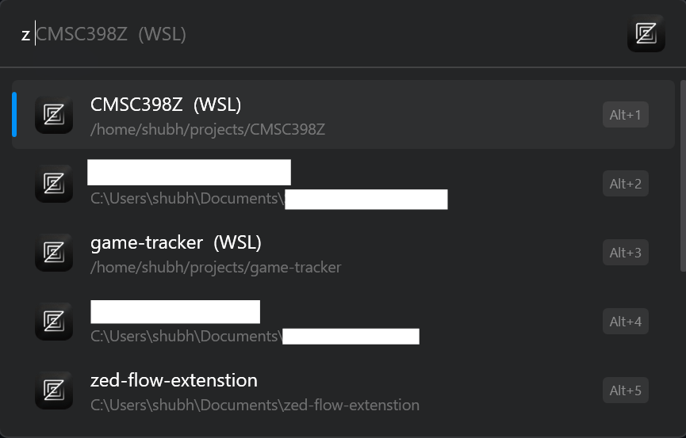

# Zed Workspaces extension for Flow Launcher

This extension provides workspace search functionality for Zed within Flow Launcher with the default keyword 'z'.

This extension supports:
- **Windows local workspaces**
- **WSL workspaces**
- **SSH remote workspaces**
- **Ability to add custom DB path in Flow Settings (If you use Nightly or Preview)**


## How it works

On Windows, Zed Stable stores workspace data in ```C:\Users\$USER\AppData\Local\Zed\db\0-stable\db.sqlite```.

For each query, the plugin parses this sqlite file and serves requests with this data.

Will add caching soon


